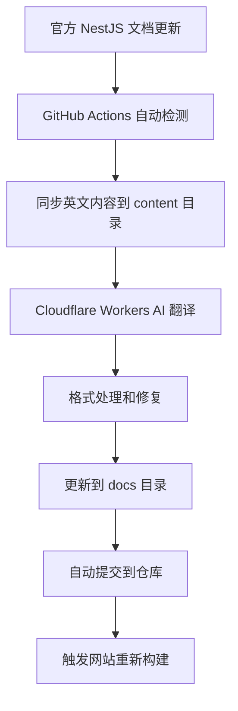

<div align="center">
  <h1>🎯 NestJS 中文文档</h1>
  <p>
    <strong>构建高效、可扩展的 Node.js Web 应用程序框架</strong>
  </p>
  <p>
    <a href="https://docs.nestjs.cn/">
      
    </a>
    <a href="https://docs.nestjs.cn/">
      
    </a>
    <a href="https://github.com/nestcn/docs.nestjs.cn/blob/main/LICENSE">
      
    </a>
  </p>
  
  <blockquote>
    <p>
      📅 <strong>最近翻译时间:</strong> <!-- LAST_SYNC_TIME --> 2025年07月01日 09:48 <!-- /LAST_SYNC_TIME -->
      <br>
      <em>文档每日自动同步并翻译，确保与官方保持同步，同步时间：</em>
      <br>
      
    </p>
  </blockquote>
</div>

---

Nest是构建高效，可扩展的 Node.js Web 应用程序的框架。 它使用现代的 JavaScript 或 TypeScript（保留与纯 JavaScript 的兼容性），并结合 OOP（面向对象编程），FP（函数式编程）和FRP（函数响应式编程）的元素。。

# 设计哲学

近几年，由于 Node.js，JavaScript 已经成为 Web 前端和后端应用程序的“通用语言”，并且有了 Angular，React 和 Vue 等令人耳目一新的项目，提高了开发人员的生产力，使得可以快速构建可测试的且可扩展的前端应用程序。 然而，在服务器端，虽然有很多优秀的库、helper 和 Node 工具，但是它们都没有有效地解决主要问题 - 架构。

Nest 旨在提供一个开箱即用的应用程序体系结构，允许轻松创建高度可测试，可扩展，松散耦合且易于维护的应用程序。

## [查看文档](https://docs.nestjs.cn/)


## 💬 社区交流

### 中文交流QQ群：     

二群：1031015552 （禁止广告）    
三群： 321735506 （禁止广告）


### TG 群

[点击加入 TG 群](https://t.me/+TCn0z6Z0wwKA_IFD)


### 微信群：

微信一群、微信二群、微信三群、微信四群        
群二维码过期，请添加：    


    


微信一二群，目前只接受 开源项目作者、nestjs 文档贡献者、捐赠者。


## 贡献者
<!-- readme: collaborators,contributors -start -->
<table>
<tr>
    <td align="center">
        <a href="https://github.com/zuohuadong">
            
            <br />
            <sub><b>zuohuadong</b></sub>
        </a>
    </td>
    <td align="center">
        <a href="https://github.com/renovate-bot">
            
            <br />
            <sub><b>renovate-bot</b></sub>
        </a>
    </td>
    <td align="center">
        <a href="https://github.com/Armor-cn">
            
            <br />
            <sub><b>Armor-cn</b></sub>
        </a>
    </td>
    <td align="center">
        <a href="https://github.com/franken133">
            
            <br />
            <sub><b>franken133</b></sub>
        </a>
    </td>
    <td align="center">
        <a href="https://github.com/fanybook">
            
            <br />
            <sub><b>fanybook</b></sub>
        </a>
    </td>
    <td align="center">
        <a href="https://github.com/tangkai123456">
            
            <br />
            <sub><b>tangkai123456</b></sub>
        </a>
    </td></tr>
<tr>
    <td align="center">
        <a href="https://github.com/tihssiefiL">
            
            <br />
            <sub><b>tihssiefiL</b></sub>
        </a>
    </td>
    <td align="center">
        <a href="https://github.com/HaveF">
            
            <br />
            <sub><b>HaveF</b></sub>
        </a>
    </td>
    <td align="center">
        <a href="https://github.com/TacKana">
            
            <br />
            <sub><b>TacKana</b></sub>
        </a>
    </td>
    <td align="center">
        <a href="https://github.com/shenX-2021">
            
            <br />
            <sub><b>shenX-2021</b></sub>
        </a>
    </td>
    <td align="center">
        <a href="https://github.com/NotEvenANeko">
            
            <br />
            <sub><b>NotEvenANeko</b></sub>
        </a>
    </td>
    <td align="center">
        <a href="https://github.com/sunsssshine">
            
            <br />
            <sub><b>sunsssshine</b></sub>
        </a>
    </td></tr>
<tr>
    <td align="center">
        <a href="https://github.com/tth37">
            
            <br />
            <sub><b>tth37</b></sub>
        </a>
    </td>
    <td align="center">
        <a href="https://github.com/ethanyou725">
            
            <br />
            <sub><b>ethanyou725</b></sub>
        </a>
    </td>
    <td align="center">
        <a href="https://github.com/elonglau">
            
            <br />
            <sub><b>elonglau</b></sub>
        </a>
    </td>
    <td align="center">
        <a href="https://github.com/ganshiqingyuan">
            
            <br />
            <sub><b>ganshiqingyuan</b></sub>
        </a>
    </td>
    <td align="center">
        <a href="https://github.com/rmlzy">
            
            <br />
            <sub><b>rmlzy</b></sub>
        </a>
    </td>
    <td align="center">
        <a href="https://github.com/younggglcy">
            
            <br />
            <sub><b>younggglcy</b></sub>
        </a>
    </td></tr>
<tr>
    <td align="center">
        <a href="https://github.com/fyzhu">
            
            <br />
            <sub><b>fyzhu</b></sub>
        </a>
    </td>
    <td align="center">
        <a href="https://github.com/Znonymous29">
            
            <br />
            <sub><b>Znonymous29</b></sub>
        </a>
    </td>
    <td align="center">
        <a href="https://github.com/Jimmysh">
            
            <br />
            <sub><b>Jimmysh</b></sub>
        </a>
    </td>
    <td align="center">
        <a href="https://github.com/heiye9">
            
            <br />
            <sub><b>heiye9</b></sub>
        </a>
    </td>
    <td align="center">
        <a href="https://github.com/iyangsheng">
            
            <br />
            <sub><b>iyangsheng</b></sub>
        </a>
    </td>
    <td align="center">
        <a href="https://github.com/yuu2lee4">
            
            <br />
            <sub><b>yuu2lee4</b></sub>
        </a>
    </td></tr>
<tr>
    <td align="center">
        <a href="https://github.com/zxC0der">
            
            <br />
            <sub><b>zxC0der</b></sub>
        </a>
    </td>
    <td align="center">
        <a href="https://github.com/finalwhy">
            
            <br />
            <sub><b>finalwhy</b></sub>
        </a>
    </td>
    <td align="center">
        <a href="https://github.com/NNNNzs">
            
            <br />
            <sub><b>NNNNzs</b></sub>
        </a>
    </td>
    <td align="center">
        <a href="https://github.com/fishel-feng">
            
            <br />
            <sub><b>fishel-feng</b></sub>
        </a>
    </td>
    <td align="center">
        <a href="https://github.com/leonzhao">
            
            <br />
            <sub><b>leonzhao</b></sub>
        </a>
    </td>
    <td align="center">
        <a href="https://github.com/franken133521">
            
            <br />
            <sub><b>franken133521</b></sub>
        </a>
    </td></tr>
<tr>
    <td align="center">
        <a href="https://github.com/bushuai">
            
            <br />
            <sub><b>bushuai</b></sub>
        </a>
    </td>
    <td align="center">
        <a href="https://github.com/BG7ZAG">
            
            <br />
            <sub><b>BG7ZAG</b></sub>
        </a>
    </td>
    <td align="center">
        <a href="https://github.com/Huauauaa">
            
            <br />
            <sub><b>Huauauaa</b></sub>
        </a>
    </td>
    <td align="center">
        <a href="https://github.com/warriorsloong">
            
            <br />
            <sub><b>warriorsloong</b></sub>
        </a>
    </td>
    <td align="center">
        <a href="https://github.com/AqingCyan">
            
            <br />
            <sub><b>AqingCyan</b></sub>
        </a>
    </td>
    <td align="center">
        <a href="https://github.com/ZhangLinkang">
            
            <br />
            <sub><b>ZhangLinkang</b></sub>
        </a>
    </td></tr>
<tr>
    <td align="center">
        <a href="https://github.com/baby7305">
            
            <br />
            <sub><b>baby7305</b></sub>
        </a>
    </td>
    <td align="center">
        <a href="https://github.com/bigggge">
            
            <br />
            <sub><b>bigggge</b></sub>
        </a>
    </td>
    <td align="center">
        <a href="https://github.com/jdumpling">
            
            <br />
            <sub><b>jdumpling</b></sub>
        </a>
    </td>
    <td align="center">
        <a href="https://github.com/lpjia">
            
            <br />
            <sub><b>lpjia</b></sub>
        </a>
    </td>
    <td align="center">
        <a href="https://github.com/rookie-luochao">
            
            <br />
            <sub><b>rookie-luochao</b></sub>
        </a>
    </td>
    <td align="center">
        <a href="https://github.com/mecoepcoo">
            
            <br />
            <sub><b>mecoepcoo</b></sub>
        </a>
    </td></tr>
<tr>
    <td align="center">
        <a href="https://github.com/zhysky">
            
            <br />
            <sub><b>zhysky</b></sub>
        </a>
    </td>
    <td align="center">
        <a href="https://github.com/raotaohub">
            
            <br />
            <sub><b>raotaohub</b></sub>
        </a>
    </td>
    <td align="center">
        <a href="https://github.com/wintsa123">
            
            <br />
            <sub><b>wintsa123</b></sub>
        </a>
    </td>
    <td align="center">
        <a href="https://github.com/gjbxy">
            
            <br />
            <sub><b>gjbxy</b></sub>
        </a>
    </td>
    <td align="center">
        <a href="https://github.com/yuntian001">
            
            <br />
            <sub><b>yuntian001</b></sub>
        </a>
    </td>
    <td align="center">
        <a href="https://github.com/zhixiangyao">
            
            <br />
            <sub><b>zhixiangyao</b></sub>
        </a>
    </td></tr>
<tr>
    <td align="center">
        <a href="https://github.com/toimc">
            
            <br />
            <sub><b>toimc</b></sub>
        </a>
    </td>
    <td align="center">
        <a href="https://github.com/songzeng2016">
            
            <br />
            <sub><b>songzeng2016</b></sub>
        </a>
    </td>
    <td align="center">
        <a href="https://github.com/wuwb">
            
            <br />
            <sub><b>wuwb</b></sub>
        </a>
    </td>
    <td align="center">
        <a href="https://github.com/alantsui5">
            
            <br />
            <sub><b>alantsui5</b></sub>
        </a>
    </td>
    <td align="center">
        <a href="https://github.com/meepobrother">
            
            <br />
            <sub><b>meepobrother</b></sub>
        </a>
    </td>
    <td align="center">
        <a href="https://github.com/Alkaidcc">
            
            <br />
            <sub><b>Alkaidcc</b></sub>
        </a>
    </td></tr>
<tr>
    <td align="center">
        <a href="https://github.com/Char2sGu">
            
            <br />
            <sub><b>Char2sGu</b></sub>
        </a>
    </td>
    <td align="center">
        <a href="https://github.com/GuoJikun">
            
            <br />
            <sub><b>GuoJikun</b></sub>
        </a>
    </td>
    <td align="center">
        <a href="https://github.com/hengistchan">
            
            <br />
            <sub><b>hengistchan</b></sub>
        </a>
    </td>
    <td align="center">
        <a href="https://github.com/okxiaoliang4">
            
            <br />
            <sub><b>okxiaoliang4</b></sub>
        </a>
    </td>
    <td align="center">
        <a href="https://github.com/Kennytian">
            
            <br />
            <sub><b>Kennytian</b></sub>
        </a>
    </td>
    <td align="center">
        <a href="https://github.com/lxKylin">
            
            <br />
            <sub><b>lxKylin</b></sub>
        </a>
    </td></tr>
<tr>
    <td align="center">
        <a href="https://github.com/ThisIsLoui">
            
            <br />
            <sub><b>ThisIsLoui</b></sub>
        </a>
    </td>
    <td align="center">
        <a href="https://github.com/sunpm">
            
            <br />
            <sub><b>sunpm</b></sub>
        </a>
    </td>
    <td align="center">
        <a href="https://github.com/wu-yu-pei">
            
            <br />
            <sub><b>wu-yu-pei</b></sub>
        </a>
    </td>
    <td align="center">
        <a href="https://github.com/Wzb3422">
            
            <br />
            <sub><b>Wzb3422</b></sub>
        </a>
    </td>
    <td align="center">
        <a href="https://github.com/Erchoc">
            
            <br />
            <sub><b>Erchoc</b></sub>
        </a>
    </td>
    <td align="center">
        <a href="https://github.com/Gavin-Gong">
            
            <br />
            <sub><b>Gavin-Gong</b></sub>
        </a>
    </td></tr>
<tr>
    <td align="center">
        <a href="https://github.com/Xecuss">
            
            <br />
            <sub><b>Xecuss</b></sub>
        </a>
    </td>
    <td align="center">
        <a href="https://github.com/HelTi">
            
            <br />
            <sub><b>HelTi</b></sub>
        </a>
    </td>
    <td align="center">
        <a href="https://github.com/myfreax">
            
            <br />
            <sub><b>myfreax</b></sub>
        </a>
    </td>
    <td align="center">
        <a href="https://github.com/heng1025">
            
            <br />
            <sub><b>heng1025</b></sub>
        </a>
    </td>
    <td align="center">
        <a href="https://github.com/jiaruh">
            
            <br />
            <sub><b>jiaruh</b></sub>
        </a>
    </td>
    <td align="center">
        <a href="https://github.com/wenjianmin">
            
            <br />
            <sub><b>wenjianmin</b></sub>
        </a>
    </td></tr>
<tr>
    <td align="center">
        <a href="https://github.com/kenlig">
            
            <br />
            <sub><b>kenlig</b></sub>
        </a>
    </td>
    <td align="center">
        <a href="https://github.com/lizhongyi">
            
            <br />
            <sub><b>lizhongyi</b></sub>
        </a>
    </td>
    <td align="center">
        <a href="https://github.com/Teeoo">
            
            <br />
            <sub><b>Teeoo</b></sub>
        </a>
    </td>
    <td align="center">
        <a href="https://github.com/litingyes">
            
            <br />
            <sub><b>litingyes</b></sub>
        </a>
    </td>
    <td align="center">
        <a href="https://github.com/Mayness">
            
            <br />
            <sub><b>Mayness</b></sub>
        </a>
    </td>
    <td align="center">
        <a href="https://github.com/hhhuaang">
            
            <br />
            <sub><b>hhhuaang</b></sub>
        </a>
    </td></tr>
<tr>
    <td align="center">
        <a href="https://github.com/gaogaoinvincible">
            
            <br />
            <sub><b>gaogaoinvincible</b></sub>
        </a>
    </td>
    <td align="center">
        <a href="https://github.com/Frorice">
            
            <br />
            <sub><b>Frorice</b></sub>
        </a>
    </td>
    <td align="center">
        <a href="https://github.com/ezhq">
            
            <br />
            <sub><b>ezhq</b></sub>
        </a>
    </td>
    <td align="center">
        <a href="https://github.com/dengshenkk">
            
            <br />
            <sub><b>dengshenkk</b></sub>
        </a>
    </td>
    <td align="center">
        <a href="https://github.com/dangqi888">
            
            <br />
            <sub><b>dangqi888</b></sub>
        </a>
    </td>
    <td align="center">
        <a href="https://github.com/chengzhenguo1">
            
            <br />
            <sub><b>chengzhenguo1</b></sub>
        </a>
    </td></tr>
<tr>
    <td align="center">
        <a href="https://github.com/chenc041">
            
            <br />
            <sub><b>chenc041</b></sub>
        </a>
    </td>
    <td align="center">
        <a href="https://github.com/buqiyuan">
            
            <br />
            <sub><b>buqiyuan</b></sub>
        </a>
    </td>
    <td align="center">
        <a href="https://github.com/zhupengfeivip">
            
            <br />
            <sub><b>zhupengfeivip</b></sub>
        </a>
    </td>
    <td align="center">
        <a href="https://github.com/akai007">
            
            <br />
            <sub><b>akai007</b></sub>
        </a>
    </td>
    <td align="center">
        <a href="https://github.com/muyu66">
            
            <br />
            <sub><b>muyu66</b></sub>
        </a>
    </td>
    <td align="center">
        <a href="https://github.com/Cacivy">
            
            <br />
            <sub><b>Cacivy</b></sub>
        </a>
    </td></tr>
<tr>
    <td align="center">
        <a href="https://github.com/Zeng1998">
            
            <br />
            <sub><b>Zeng1998</b></sub>
        </a>
    </td>
    <td align="center">
        <a href="https://github.com/mowangjuanzi">
            
            <br />
            <sub><b>mowangjuanzi</b></sub>
        </a>
    </td>
    <td align="center">
        <a href="https://github.com/xrr2016">
            
            <br />
            <sub><b>xrr2016</b></sub>
        </a>
    </td>
    <td align="center">
        <a href="https://github.com/woai3c">
            
            <br />
            <sub><b>woai3c</b></sub>
        </a>
    </td>
    <td align="center">
        <a href="https://github.com/liangpengyv">
            
            <br />
            <sub><b>liangpengyv</b></sub>
        </a>
    </td>
    <td align="center">
        <a href="https://github.com/qunbotop">
            
            <br />
            <sub><b>qunbotop</b></sub>
        </a>
    </td></tr>
<tr>
    <td align="center">
        <a href="https://github.com/think2011">
            
            <br />
            <sub><b>think2011</b></sub>
        </a>
    </td>
    <td align="center">
        <a href="https://github.com/gaga-change">
            
            <br />
            <sub><b>gaga-change</b></sub>
        </a>
    </td>
    <td align="center">
        <a href="https://github.com/zyu">
            
            <br />
            <sub><b>zyu</b></sub>
        </a>
    </td>
    <td align="center">
        <a href="https://github.com/zemor923">
            
            <br />
            <sub><b>zemor923</b></sub>
        </a>
    </td>
    <td align="center">
        <a href="https://github.com/bigyifeng">
            
            <br />
            <sub><b>bigyifeng</b></sub>
        </a>
    </td>
    <td align="center">
        <a href="https://github.com/xdlover">
            
            <br />
            <sub><b>xdlover</b></sub>
        </a>
    </td></tr>
<tr>
    <td align="center">
        <a href="https://github.com/wyn77">
            
            <br />
            <sub><b>wyn77</b></sub>
        </a>
    </td>
    <td align="center">
        <a href="https://github.com/wujingquan">
            
            <br />
            <sub><b>wujingquan</b></sub>
        </a>
    </td>
    <td align="center">
        <a href="https://github.com/wangkunmeng">
            
            <br />
            <sub><b>wangkunmeng</b></sub>
        </a>
    </td>
    <td align="center">
        <a href="https://github.com/uxuip">
            
            <br />
            <sub><b>uxuip</b></sub>
        </a>
    </td>
    <td align="center">
        <a href="https://github.com/sunet693">
            
            <br />
            <sub><b>sunet693</b></sub>
        </a>
    </td>
    <td align="center">
        <a href="https://github.com/mhfe123">
            
            <br />
            <sub><b>mhfe123</b></sub>
        </a>
    </td></tr>
<tr>
    <td align="center">
        <a href="https://github.com/skipsoul">
            
            <br />
            <sub><b>skipsoul</b></sub>
        </a>
    </td>
    <td align="center">
        <a href="https://github.com/redismsgs">
            
            <br />
            <sub><b>redismsgs</b></sub>
        </a>
    </td>
    <td align="center">
        <a href="https://github.com/Ran968777">
            
            <br />
            <sub><b>Ran968777</b></sub>
        </a>
    </td>
    <td align="center">
        <a href="https://github.com/Hucy">
            
            <br />
            <sub><b>Hucy</b></sub>
        </a>
    </td>
    <td align="center">
        <a href="https://github.com/pengzhanbo">
            
            <br />
            <sub><b>pengzhanbo</b></sub>
        </a>
    </td>
    <td align="center">
        <a href="https://github.com/edgexie">
            
            <br />
            <sub><b>edgexie</b></sub>
        </a>
    </td></tr>
<tr>
    <td align="center">
        <a href="https://github.com/BM-laoli">
            
            <br />
            <sub><b>BM-laoli</b></sub>
        </a>
    </td>
    <td align="center">
        <a href="https://github.com/hom">
            
            <br />
            <sub><b>hom</b></sub>
        </a>
    </td>
    <td align="center">
        <a href="https://github.com/linbudu599">
            
            <br />
            <sub><b>linbudu599</b></sub>
        </a>
    </td>
    <td align="center">
        <a href="https://github.com/KenyeeC">
            
            <br />
            <sub><b>KenyeeC</b></sub>
        </a>
    </td>
    <td align="center">
        <a href="https://github.com/Jelly38214">
            
            <br />
            <sub><b>Jelly38214</b></sub>
        </a>
    </td>
    <td align="center">
        <a href="https://github.com/JailBreakC">
            
            <br />
            <sub><b>JailBreakC</b></sub>
        </a>
    </td></tr>
<tr>
    <td align="center">
        <a href="https://github.com/IOLOII">
            
            <br />
            <sub><b>IOLOII</b></sub>
        </a>
    </td>
    <td align="center">
        <a href="https://github.com/McCarthey">
            
            <br />
            <sub><b>McCarthey</b></sub>
        </a>
    </td>
    <td align="center">
        <a href="https://github.com/fuergaosi233">
            
            <br />
            <sub><b>fuergaosi233</b></sub>
        </a>
    </td>
    <td align="center">
        <a href="https://github.com/Grapedge">
            
            <br />
            <sub><b>Grapedge</b></sub>
        </a>
    </td>
    <td align="center">
        <a href="https://github.com/genalhuang">
            
            <br />
            <sub><b>genalhuang</b></sub>
        </a>
    </td>
    <td align="center">
        <a href="https://github.com/wjw-gavin">
            
            <br />
            <sub><b>wjw-gavin</b></sub>
        </a>
    </td></tr>
<tr>
    <td align="center">
        <a href="https://github.com/GaleLQ">
            
            <br />
            <sub><b>GaleLQ</b></sub>
        </a>
    </td>
    <td align="center">
        <a href="https://github.com/Funny002">
            
            <br />
            <sub><b>Funny002</b></sub>
        </a>
    </td>
    <td align="center">
        <a href="https://github.com/ifrvn">
            
            <br />
            <sub><b>ifrvn</b></sub>
        </a>
    </td>
    <td align="center">
        <a href="https://github.com/coding-ax">
            
            <br />
            <sub><b>coding-ax</b></sub>
        </a>
    </td>
    <td align="center">
        <a href="https://github.com/lemontree2000">
            
            <br />
            <sub><b>lemontree2000</b></sub>
        </a>
    </td>
    <td align="center">
        <a href="https://github.com/DougLee">
            
            <br />
            <sub><b>DougLee</b></sub>
        </a>
    </td></tr>
<tr>
    <td align="center">
        <a href="https://github.com/wangdicoder">
            
            <br />
            <sub><b>wangdicoder</b></sub>
        </a>
    </td>
    <td align="center">
        <a href="https://github.com/ManiuLtd">
            
            <br />
            <sub><b>ManiuLtd</b></sub>
        </a>
    </td>
    <td align="center">
        <a href="https://github.com/CosPie">
            
            <br />
            <sub><b>CosPie</b></sub>
        </a>
    </td>
    <td align="center">
        <a href="https://github.com/BYVoid">
            
            <br />
            <sub><b>BYVoid</b></sub>
        </a>
    </td>
    <td align="center">
        <a href="https://github.com/caperso">
            
            <br />
            <sub><b>caperso</b></sub>
        </a>
    </td>
    <td align="center">
        <a href="https://github.com/CaanDoll">
            
            <br />
            <sub><b>CaanDoll</b></sub>
        </a>
    </td></tr>
<tr>
    <td align="center">
        <a href="https://github.com/Ancss">
            
            <br />
            <sub><b>Ancss</b></sub>
        </a>
    </td>
    <td align="center">
        <a href="https://github.com/yunyu950908">
            
            <br />
            <sub><b>yunyu950908</b></sub>
        </a>
    </td>
    <td align="center">
        <a href="https://github.com/youmengme">
            
            <br />
            <sub><b>youmengme</b></sub>
        </a>
    </td>
    <td align="center">
        <a href="https://github.com/Yaob1990">
            
            <br />
            <sub><b>Yaob1990</b></sub>
        </a>
    </td>
    <td align="center">
        <a href="https://github.com/YangFong">
            
            <br />
            <sub><b>YangFong</b></sub>
        </a>
    </td>
    <td align="center">
        <a href="https://github.com/NuoHui">
            
            <br />
            <sub><b>NuoHui</b></sub>
        </a>
    </td></tr>
<tr>
    <td align="center">
        <a href="https://github.com/XHalso">
            
            <br />
            <sub><b>XHalso</b></sub>
        </a>
    </td>
    <td align="center">
        <a href="https://github.com/Lydanne">
            
            <br />
            <sub><b>Lydanne</b></sub>
        </a>
    </td>
    <td align="center">
        <a href="https://github.com/WinChance">
            
            <br />
            <sub><b>WinChance</b></sub>
        </a>
    </td>
    <td align="center">
        <a href="https://github.com/Wuwei9536">
            
            <br />
            <sub><b>Wuwei9536</b></sub>
        </a>
    </td>
    <td align="center">
        <a href="https://github.com/WenyXu">
            
            <br />
            <sub><b>WenyXu</b></sub>
        </a>
    </td>
    <td align="center">
        <a href="https://github.com/wangzishi">
            
            <br />
            <sub><b>wangzishi</b></sub>
        </a>
    </td></tr>
<tr>
    <td align="center">
        <a href="https://github.com/TrumanGao">
            
            <br />
            <sub><b>TrumanGao</b></sub>
        </a>
    </td>
    <td align="center">
        <a href="https://github.com/TerrniT">
            
            <br />
            <sub><b>TerrniT</b></sub>
        </a>
    </td>
    <td align="center">
        <a href="https://github.com/ShingLi">
            
            <br />
            <sub><b>ShingLi</b></sub>
        </a>
    </td>
    <td align="center">
        <a href="https://github.com/phpjavac">
            
            <br />
            <sub><b>phpjavac</b></sub>
        </a>
    </td>
    <td align="center">
        <a href="https://github.com/a20185">
            
            <br />
            <sub><b>a20185</b></sub>
        </a>
    </td>
    <td align="center">
        <a href="https://github.com/WShiBin">
            
            <br />
            <sub><b>WShiBin</b></sub>
        </a>
    </td></tr>
<tr>
    <td align="center">
        <a href="https://github.com/SJcz">
            
            <br />
            <sub><b>SJcz</b></sub>
        </a>
    </td>
    <td align="center">
        <a href="https://github.com/wuliupo">
            
            <br />
            <sub><b>wuliupo</b></sub>
        </a>
    </td>
    <td align="center">
        <a href="https://github.com/Onekki">
            
            <br />
            <sub><b>Onekki</b></sub>
        </a>
    </td>
    <td align="center">
        <a href="https://github.com/HoHow">
            
            <br />
            <sub><b>HoHow</b></sub>
        </a>
    </td>
    <td align="center">
        <a href="https://github.com/Nugine">
            
            <br />
            <sub><b>Nugine</b></sub>
        </a>
    </td>
    <td align="center">
        <a href="https://github.com/hcfw007">
            
            <br />
            <sub><b>hcfw007</b></sub>
        </a>
    </td></tr>
<tr>
    <td align="center">
        <a href="https://github.com/mnixry">
            
            <br />
            <sub><b>mnixry</b></sub>
        </a>
    </td>
    <td align="center">
        <a href="https://github.com/philipxyc">
            
            <br />
            <sub><b>philipxyc</b></sub>
        </a>
    </td>
    <td align="center">
        <a href="https://github.com/luoxzhg">
            
            <br />
            <sub><b>luoxzhg</b></sub>
        </a>
    </td></tr>
</table>
<!-- readme: collaborators,contributors -end -->


## 🤝 如何贡献

<div align="center">
  <h3>🌟 欢迎各种形式的贡献！</h3>
  <p>让我们一起让 NestJS 中文文档变得更好</p>
</div>

<table>
  <tr>
    <td align="center" width="25%">
      
      <br>
      <strong>📝 文档改进</strong>
      <ul>
        <li>发现翻译错误或不准确的地方</li>
        <li>改进文档的表达和可读性</li>
        <li>补充遗漏的内容或示例</li>
      </ul>
    </td>
    <td align="center" width="25%">
      
      <br>
      <strong>🔧 技术贡献</strong>
      <ul>
        <li>优化 AI 翻译脚本</li>
        <li>改进构建和部署流程</li>
        <li>修复 Bug 或添加新功能</li>
      </ul>
    </td>
    <td align="center" width="25%">
      
      <br>
      <strong>🎯 翻译贡献</strong>
      <ul>
        <li>参与 AI 翻译结果的人工校对</li>
        <li>为翻译系统提供术语对照表</li>
        <li>优化翻译质量和一致性</li>
      </ul>
    </td>
    <td align="center" width="25%">
      
      <br>
      <strong>💡 建议反馈</strong>
      <ul>
        <li>提出改进建议</li>
        <li>报告问题和 Bug</li>
        <li>分享使用体验</li>
      </ul>
    </td>
  </tr>
</table>

<div align="center">
  <p>
    <strong>📖 详细贡献指南</strong>
    <br>
    <a href="https://github.com/nestcn/docs.nestjs.cn/blob/main/CONTRIBUTING.md">
      
    </a>
  </p>
</div>

## 🤝 支持与赞助

<div align="center">
  <h3>💝 感谢以下服务商对本项目的支持</h3>
</div>

### 🏢 基础设施赞助商

<table align="center">
  <tr>
    <td align="center" width="25%">
      <a href="https://www.cloudflare.com">
        
      </a>
      <br>
      <strong>网站托管</strong>
      <br>
      <sub>全球 CDN 加速</sub>
    </td>
    <td align="center" width="25%">
      <a href="https://partner.jdcloud.com/partner/notice/39c68afb71a544e4883b6cd79bb5dffd">
        
      </a>
      <br>
      <strong>云服务器</strong>
      <br>
      <sub>产品 6 折起 / 296元3年</sub>
    </td>
    <td align="center" width="25%">
      <a href="https://www.vultr.com/?ref=8967015-8H">
        
      </a>
      <br>
      <strong>VPS 主机</strong>
      <br>
      <sub>免费送 $100</sub>
    </td>
    <td align="center" width="25%">
      <a href="https://ssls.sjv.io/e4OKrg">
        
      </a>
      <br>
      <strong>SSL 证书</strong>
      <br>
      <sub>便宜证书服务</sub>
    </td>
  </tr>
</table>

### 🔧 其他服务商

<table align="center">
  <tr>
    <td align="center" width="33%">
      <a href="https://clientarea.ramnode.com/aff.php?aff=3451">
        
      </a>
    </td>
    <td align="center" width="33%">
      <a href="https://www.onevps.cloud/?aff=12238">
        
      </a>
    </td>
    <td align="center" width="33%">
      <a href="https://bbxy.cloud/auth/register?code=GPTR">
        
      </a>
    </td>
  </tr>
</table>

<div align="center">
  <p>
    <a href="https://justmysocks3.net/members/aff.php?aff=6423">
      
    </a>
  </p>
</div>   


## 📺 推荐视频

<div align="center">

| 创作者 | 平台 | 简介 | 观看 |
|:---:|:---:|:---|:---:|
| **全栈之巅** | B站 | 专业的全栈开发技术分享，涵盖 NestJS、Node.js 等现代开发技术 | [](https://space.bilibili.com/341919508) |

</div>

> 💡 **提示**: 如果你有优质的 NestJS 视频教程，欢迎通过 [Issue](https://github.com/nestcn/docs.nestjs.cn/issues) 推荐给我们！

## 相关书籍

[《NestJS全栈开发解析：快速上手与实践》（大陆首发🎉🎉🎉）](https://union-click.jd.com/jdc?e=618%7Cpc%7C&p=JF8BAQoJK1olXwIBVFlaAUwWC18IHlgcXwQLXG4ZVxNJXF9RXh5UHw0cSgYYXBcIWDoXSQVJQwYHV1dfCkIfHDZNRwYlJ0FKTg4NeEtydit2TVl1BlEcThY2XkcbM244G1MRWwUDVlleOHsXBF9adYOj696n5UKJosTCi_g4GmsVWwUFXFhUCEweAGYBK1wVVDYCVFtdCkwSH2kOGl0VXAUCZG5tC3sQA2YcHSlUDxIEJm5tCHsUM28JG1IcXQYKXFhVFEsWBWcMGkcVWwUFXFhUCEwWB28MK1kUXAILZG5tXhVyQQsMEyhUDlBKUFgObDMfcTBLZFN3MwRKEBcDcxlzCi5oew1LXAYFUG5YOA)

[《深入浅出 Node.js》](https://union-click.jd.com/jdc?e=&p=JF8AAMQDIgZlGmsVAhADURNdHDJWWA1FBCVbV0IUWVALHEpCAUdETlcNVQtHRRUCEANRE10cHUtCCUZrEBxaXRNvH35ib3U-fgBgdGh7BlguQw4eN1QrWx0GFARUGVwWMiIHUisNewITBlQaWhAGFQBlGmsVBREAUBNcFgMXD1MTaxICGzdVG14VABUCSR1dFAQSBlYbayUyETdlK1slASJFO0kJHQoRUF0dW0FVQgIGGl9GUBEOVhhZFQAQBVFMDBdQIgVUGl8c)


[《狼书（卷1）：更了不起的 Node.js》](https://union-click.jd.com/jdc?e=&p=JF8AAMQDIgZlGmsVARUEVxheHDJWWA1FBCVbV0IUWVALHEpCAUdETlcNVQtHRRUBFQRXGF4cHUtCCUZrUVprQBVNOmZnVHEGAQJuBFdvEEg5Uw4eN1QrWx0GFARUGVwWMiIHUisNewITBlQaWhACFwRlGmsVBREAUBNcFwcVD1YeaxICGzdVG14VABUCSR1dFAQSBlYbayUyETdlK1slASJFOx5fRgVAVFcdDBEFQQIFE1gcB0UCBxkOQAUQBlVMC0FRIgVUGl8c)

[《狼书（卷2）：Node.js Web应用开发》](https://union-click.jd.com/jdc?e=&p=JF8AAMQDIgZlGmsVARUHUBNYEzJWWA1FBCVbV0IUWVALHEpCAUdETlcNVQtHRRUBFQdQE1gTHUtCCUZrQkVJASYBWxFidkdcegVqYRRwXWQfZQ4eN1QrWx0GFARUGVwWMiIHUisNewITBlQaWhACFwRlGmsVBREAUBNcEAETBlEYaxICGzdVG14VABUCSR1dFAQSBlYbayUyETdlK1slASJFO0xfQQITAVZPXBcAFwICS1sdVUABV05eQFcaB10YXRAEIgVUGl8c)

[《深入理解 TypeScript》](https://union-click.jd.com/jdc?e=&p=JF8AAMQDIgZlGmsVARQDURxYEDJWWA1FBCVbV0IUWVALHEpCAUdETlcNVQtHRRUBFANRHFgQHUtCCUZraFBxBi8cWBxnR3EsRAVLUUQBMmRcZQ4eN1QrWx0GFARUGVwWMiIHUisNewITBlQaWhACFwRlGmsVBREAUBNcEgsSAVcbaxICGzdVG14VABUCSR1dFAQSBlYbayUyETdlK1slASJFO0kOHAdGU1xIWUBXQQJTS1wdAhABVhJZHQoWD1UeDxMCIgVUGl8c)

[《前端serverless面向全栈的无服务器架构实战》](https://union-click.jd.com/jdc?e=&p=JF8AAMQDIgZlGmsVABEGXBxfEjJWWA1FBCVbV0IUWVALHEpCAUdETlcNVQtHRRUAEQZcHF8SHUtCCUZrYF0SYUtIX3dgR0c2ExMQQhJhL0cAdQ4eN1QrWx0GFARUGVwWMiIHUisNewITBlQaWhACFwRlGmsVBREAURpbFwUQD1ISaxICGzdVG14VABUCSR1dFAQSBlYbayUyETdlK1slASJFOxtbFgobB1NPDkUKEwIFHAlFBRVTBkkPEAcQAwEbWhBXIgVUGl8c)

[《JavaScript悟道》](https://union-click.jd.com/jdc?e=&p=JF8AAMQDIgZlGmsVARsOVxhfHTJWWA1FBCVbV0IUWVALHEpCAUdETlcNVQtHRRUBGw5XGF8dHUtCCUZrcnx7Xx4SGxxhQHUdUhMWcEpVB1tbUw4eN1QrWx0GFARUGVwWMiIHUisNewITBlQaWhAGFQBlGmsVBREAURpbEgYRAVYSaxICGzdVG14VABUCSR1dFAQSBlYbayUyETdlK1slASJFOx4JFgpADgBIDhYHEQIBH1tGV0UBVxIMRgtFDwAcDkIHIgVUGl8c)

[《Node.js设计模式》](https://union-click.jd.com/jdc?e=&p=JF8AALsDIgZlGmsXAxcDXBpZFzJWWA1FBCVbV0IUWVALHEpCAUdETlcNVQtHRRcDFwNcGlkXHUtCCUZrXnhPWh5cLEVnaVdUBRNLQAhvUFMoQw4eN1QrWx0GFARUGVwWMiIHUisQewMiBmUbXBYFFgZVH14dBRUEZRxbHDISB1AbWRIHDgFTGl0VAxEHZStrFjIiN1UrWCVAfFIAHA8cA0YOUUsPHAdGAl0SWBYEEwcHGF1HBhBUBx5cJQATBlES)


[《Node.js 区块链开发》](https://union-click.jd.com/jdc?e=&p=JF8AAM4DIgZlGFwXARMOUR9bFTISD1UYUhAGEgRTHmtRXUpZCisCUEdTRV4FRU1HRltKQA4KUExbSxtTFQEbAlEbWBMHDV4QRwYlXRNTERxSSAJyf1J5X2B1WUYcTQdzYh4LZRprFQoWAVYaWRIBIjdVHGtUbBsBVx5cJQMiB1IYXBAKFQRcGlkUBSIAVRJrFQIXB1ccXgkEFAZTG1oWAiI3ZRhrJTISN1YrGXsBQA9dSQ8UBBUCVEheEgNGVAEdDBAHElACHwkTA0dSVytZFAMWDg)    

[《实现领域驱动设计》](https://union-click.jd.com/jdc?e=&p=JF8AAMQDIgZlGmsVABIFVR5THDJWWA1FBCVbV0IUWVALHEpCAUdETlcNVQtHRRUAEgVVHlMcHUtCCUZrE31sADEbEBFien1QE11eAWVEFGAbQw4eN1QrWx0GFARUGVwWMiIHUisNewITBlQaWhACFwRlGmsVBREAURpbEAcaB1MeaxICGzdVG14VABUCSR1dFAQSBlYbayUyETdlK1slASJFO0lSFANCA1xMUxELFQICSQkcUUAOVRlYQldHDgZOXBIDIgVUGl8c)

[《Node.js：来一打 C++ 扩展》](https://union-click.jd.com/jdc?e=&p=JF8AAMQDIgZlGmsVARAOVB5aEDJWWA1FBCVbV0IUWVALHEpCAUdETlcNVQtHRRUBEA5UHloQHUtCCUZrYwFtUhNZHBBhWkdRRylKSVJYPGw_ZQ4eN1QrWx0GFARUGVwWMiIHUisNewITBlQaWhACFwRlGmsVBREAUBNcEQsRBF0faxICGzdVG14VABUCSR1dFAQSBlYbayUyETdlK1slASJFOxpZEQtGAlNPWR1VQQJcGA5GABYCVk5YFgFBBwZLUxNXIgVUGl8c)

[《JavaScript 权威指南》](https://union-click.jd.com/jdc?e=&p=JF8AAMQDIgZlGmsVAxoBUB5ZEjJWWA1FBCVbV0IUWVALHEpCAUdETlcNVQtHRRUDGgFQHlkSHUtCCUZrSn1KXVdOJFBhEXFTfjNqUhFBDEclZQ4eN1QrWx0GFARUGVwWMiIHUisNewITBlQaWhADFgRlGmsVBREAUBNcEwoXBFYZaxICGzdVG14VABUCSR1dFAQSBlYbayUyETdlK1slASJFO0taHAdAUlQTDEUKRQJRG1kcCxZXUBwPEwESDgVMWBUAIgVUGl8c)


数据库:    

[《PostgreSQL修炼之道：从小工到专家（第2版）》](https://union-click.jd.com/jdc?e=&p=JF8AAMQDIgZlGmsVARQFUhhaFTJWWA1FBCVbV0IUWVALHEpCAUdETlcNVQtHRRUBFAVSGFoVHUtCCUZrYGtLXw9uLh1hb1s3WA8TX2ZfCGI9dQ4eN1QrWx0GFARUGVwWMiIHUisNewITBlQaWhADFgRlGmsVBREAUBNcHAQTD1ceaxICGzdVG14VABUCSR1dFAQSBlYbayUyETdlK1slASJFOx9bRwYUUgFJWkJWEQICGAgdURsCBh9dQVdAAVVOWRFQIgVUGl8c)

[《MySQL必知必会》(](https://union-click.jd.com/jdc?e=&p=JF8AAMQDIgZlGmsVARsHXBNSFjJWWA1FBCVbV0IUWVALHEpCAUdETlcNVQtHRRUBGwdcE1IWHUtCCUZrfHVGRAMbA11nW0MRUgRoXmJCCmUwQw4eN1QrWx0GFARUGVwWMiIHUisNewITBlQaWhAGFQBlGmsVBREAUBNcHQUTBVwYaxICGzdVG14VABUCSR1dFAQSBlYbayUyETdlK1slASJFOxIPQAsbAwUcWBUKFQJVSQlGA0FQUR0JFwIXUFUTWhUKIgVUGl8c)


[《MongoDB从入门到商业实战》](https://union-click.jd.com/jdc?e=&p=JF8AAMQDIgZlGmsVARYBXRpaFTJWWA1FBCVbV0IUWVALHEpCAUdETlcNVQtHRRUBFgFdGloVHUtCCUZrY1BvZR1cHnBgS1MiQSxOVUR-U0g5Uw4eN1QrWx0GFARUGVwWMiIHUisNewITBlQaWhACFwRlGmsVBREAUBNdFAAQB10SaxICGzdVG14VABUCSR1dFAQSBlYbayUyETdlK1slASJFOx1YEQcVBQIYCBNQGwIHTgtGURBXBR5eQFEQDwUfWkYFIgVUGl8c)


## 捐赠


### 支付宝红包


## 🚀 技术栈

本项目使用现代化的技术栈构建，为用户提供优秀的阅读体验：

### 📖 文档构建

- **[Rspress](https://rspress.dev/)** - 基于 Rspack 的静态站点生成器
  - ⚡ 极速构建：基于 Rust 的 Rspack 打包器
  - 🎨 现代界面：支持暗黑模式，响应式设计
  - 🔍 全文搜索：内置搜索功能，快速定位内容
  - 📱 移动友好：完美适配移动设备

### 🤖 AI 翻译

- **[Cloudflare Workers AI](https://ai.cloudflare.com/)** - 免费的 AI 翻译服务
  - 💰 完全免费：无需付费即可使用
  - 🌍 全球加速：Cloudflare 全球 CDN 网络
  - 🔒 数据安全：不存储用户数据
  - ⚡ 响应迅速：毫秒级响应时间
  - 🎯 专业翻译：针对技术文档优化的翻译效果

### 🔧 开发工具链

- **Bun** - 现代化的 JavaScript 运行时和包管理器

- **GitHub Actions** - 自动化 CI/CD 工作流
- **TypeScript** - 类型安全的开发体验
- **Tailwind CSS** - 实用优先的 CSS 框架


##  AI 自动同步翻译系统

本项目实现了完全自动化的文档同步和翻译流程：

### ✨ 核心特性

- **📚 智能同步**: 每日自动检测官方文档更新
- **🤖 AI 翻译**: 使用 Cloudflare Workers AI 智能翻译新增内容
- **🔒 代码保护**: 自动保护代码块、链接、HTML 标签不被翻译
- **📈 增量更新**: 只翻译变更的部分，提高效率
- **💾 智能缓存**: 避免重复翻译，节省资源
- **🔧 格式修复**: 自动处理官方文档的特殊标记和格式

### 🎯 工作流程



### 📋 配置指南

- 📚 [Cloudflare Workers AI 配置指南](CLOUDFLARE_AI_SETUP.md)
- ⚙️ [GitHub Actions 自动翻译配置](GITHUB_ACTIONS_SETUP.md)
- 🛠️ [翻译脚本使用说明](scripts/README.md)

### 🎉 翻译质量

我们的 AI 翻译系统专门针对 NestJS 技术文档进行了优化：

- ✅ **术语一致性**: 保持 Controller、Service、Module 等技术术语的一致性
- ✅ **代码完整性**: 确保代码示例和变量名保持原样
- ✅ **格式准确性**: 维护 Markdown 格式和链接的完整性
- ✅ **上下文理解**: 基于 NestJS 生态系统的专业翻译

### 📊 项目状态

[](https://github.com/nestcn/docs.nestjs.cn/actions/workflows/sync-official-docs.yml)
[](https://github.com/nestcn/docs.nestjs.cn/actions/workflows/fix-code-blocks.yml)

- 🔄 **自动同步**: 每日北京时间 10:00 自动同步官方文档
- 🤖 **AI 翻译**: 使用 Cloudflare Workers AI 提供高质量翻译
- 📈 **实时更新**: 文档更新后自动部署到生产环境
- 🚀 **快速访问**: 基于 Rspress 的极速加载体验

### 🚀 快速开始

如果你想在本地运行此项目或贡献翻译：

```bash
# 克隆仓库
git clone https://github.com/nestcn/docs.nestjs.cn.git
cd docs.nestjs.cn

# 安装依赖
npm install

# 本地开发
npm run dev

# 构建生产版本
npm run build
```

#### 配置 AI 翻译（可选）

如果你想使用 AI 翻译功能：

1. 获取 [Cloudflare Workers AI](CLOUDFLARE_AI_SETUP.md) 凭据
2. 设置环境变量：
   ```bash
   export CLOUDFLARE_API_TOKEN="your-token"
   export CLOUDFLARE_ACCOUNT_ID="your-account-id"
   ```
3. 运行翻译：
   ```bash
   npm run translate-docs:verbose
   ```
